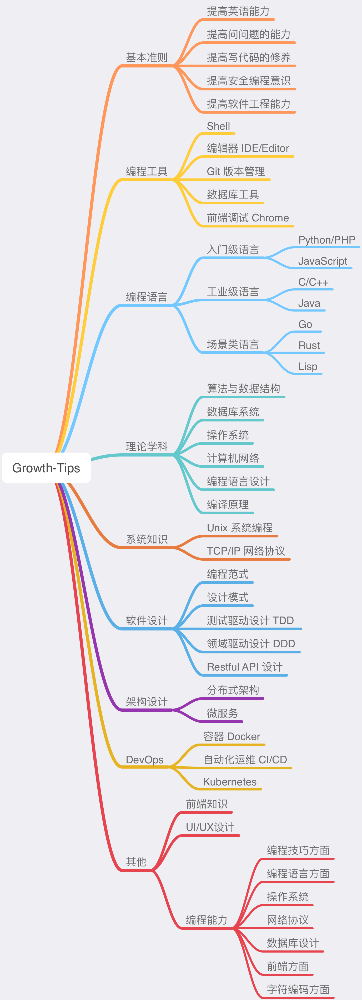

<h1 align="center">《程序员成长之路》V1.0</h1>

## 前言

计算机基础是程序员的"内功"，只有修炼好"内功"，才能成长的更快。

## 思维导图

## 实践思路

> 参考陈皓《程序员练级攻略的正确打开方式》 

- `实验室` (写一些实验性的程序验证或知识点，出了问题可以进行修复)
- `工作室` (以完整的软件功能为主，可以让用户来用的东西)
- `工厂` (工厂是有相关的工业标准，有一整套的规范和标准)

## 目录

### 编程工具

**- 编程工具 - Shell**

- [Shell: Shell 脚本常用语法手册](./programming-tools/shell/script-basic-manual.md)
- [Shell: 使用 Git 仓库来管理你的 dotfiles 配置](./programming-tools/shell/dotfiles.md)

**- 编程工具 - IDE**

### 编程语言

**- 编程语言 - PHP** 

- [PHP: 符合 PSR2 的 PHP 编码规范](./programming-languages/php/php-code-standard.md)
- [PHP: PHP 性能优化建议](./programming-languages/php/php-performance-optimization.md)

**- 编程语言 - Java**

