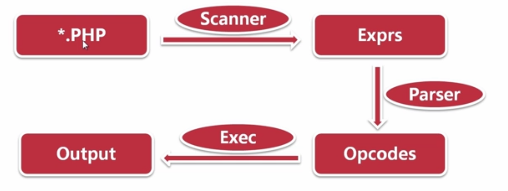
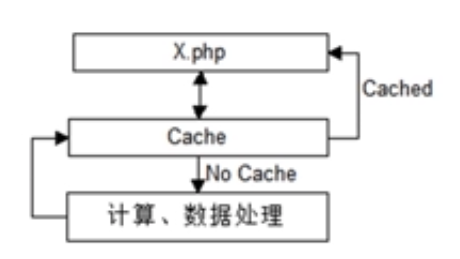

# PHP性能优化技巧

PHP 性能优化技巧，大部分是可以在平时编码中多多注意。一般情况下，PHP本身的性能对项目的影响较小。

虽然是PHP性能优化，但可以从全局的角度来看待这个问题。

## PHP 性能优化方向

- PHP 语言级的性能优化
- PHP 周边问题的性能优化
- PHP 语言自身分析、优化

## PHP语言级的性能优化

### 压力测试工具 Apache Benchmark  (ab)

```bash
# wrk (recommend)
# This runs a benchmark for 30 seconds, using 12 threads, and keeping 400 HTTP connections open.
wrk -t 12 -c 400 -d30s https://www.cizel.cn/
```

- `-n`：请求数
- `-c` ：并发数

**关注点** ：

- Requests/sec：每秒接收请求(QPS）

### 优化点1. 少些代码，多用PHP自身的能力

**性能问题：**

自写代码冗余较多，可读性不佳，并且**性能低**。


**为什么性能低？**

PHP 代码需要编译解析为底层语言，这一过程每次请求都会处理一遍，开销大。

**好的方法：**

多使用 PHP 内置变量，常量，函数



### 优化点2. PHP 内置函数的性能优化

**情况描述:**

PHP 内置函数. 之间依然存在快慢差异

**好的建议：**

多去了解 PHP 内置函数的时间复杂度

### 优化点3. 尽可能少用魔法函数

**情况描述：**

PHP 提供的魔法函数，性能不佳

**为什么性能低？**

为了给 PHP 程序员省事，PHP 语言为你做了很多

**好的方法：**

尽可能规避使用 PHP 魔法函数

### 优化点4. 产生额外开销的错误抑制符 @

**情况描述：**

PHP 提供的错误抑制符只是方便懒人

**@的实际逻辑：**

在代码开始前、结束后、增加Opcode，忽略报错

**好的建议：**

建议 尽量不要使用 @错误抑制符，多使用try catch

**PHP OPcode 查看拓展 vld**

```bash
php -dvld.active=1 -dvld.excute=0 at.php
```

### 优化点5. 合理使用内存

**情况描述：**

PHP 有内存回收机制保底，但也请小心内存

**好的建议：**

利用unset() 及时释放不使用的内存（注：unset() 出现注销不掉的情况 ）

### 优化点6. 尽量少的使用正则表示式

**情况描述：**

正则表达式的回溯开销较大，「没有金刚钻别揽瓷器活  」

**好的建议**

利用字符串处理函数，实现同样的逻辑


### 优化点7. 避免在循环内做运算

**情况描述：**

循环内的计算式将会被重复计算

**问题代码**

```php
<?php
	$str = 'hello world';
	for ($i = 0; strlen($str);++$i){
	}
```

### 优化点8. 减少计算密集型业务

**情况描述：**

PHP 不适合密集型运算的场景

**为什么：**

PHP 语言特性决定了 PHP 不适合做大数据运算

**PHP适合场景：**

适合衔接Webserver 与后端服务、UI呈现

### 优化点9. 务必使用带引号字符串做键值

**情况描述：**

PHP 与将没有引号的键值当做常量，产生查找常量的开销

**好的建议：**

严格使用引号作为键值

## PHP周边问题的性能优化

### PHP周边都有什么？

- Linux 服务器

- 文件存储 （硬盘）

- 数据库

- 缓存 （内存）

- 网络 （分布式架构）

### PHP 周边对 PHP 程序的影响：

`DB.php` 约等于 `网络` + `数据库（DB）`

### 优化点1. 减少文件类操作

常见 PHP 场景的开销次序：

读写磁盘、读写数据库、读写内存、读写网络数据

读写内存 << 读写数据库 <  读写磁盘 < 读写网络数据

### 优化点2. 优化网络请求

**网络请求的坑：**

1. 对方接口的不确定因素
2. 网络稳定性

**如何优化网络请求：**

1. 设置超时时间
	- 连接超时  (建议值：`200ms`)
	- 读超时   (建议值： `800ms`)
	- 写超时   (建议值：  `500ms`)

2. 串行请求并行化
	- 使用 curl_multi_*()
	- 使用 `swoole` 拓展

### 优化点3. 压缩 PHP 接口输出

**如何压缩？**

使用Gzip即可

**压缩输出的利与弊？**

**利：**利用我们的数据输出，Client端能更快获取数据
**弊：**额外的CPU开销

### 优化点4. PHP缓存复用

**什么情况下输出内容的缓存？**

多次请求，内容不变的情况

 

## PHP 性能瓶颈的解决方案

解决方案：

- Opcode Cache：PHP 拓展APC
- Memcached
- yac

拓展实现：通过 PHP 拓展替代原 PHP 代码中高频逻辑

终极方案：更换Golang or Java 语言
