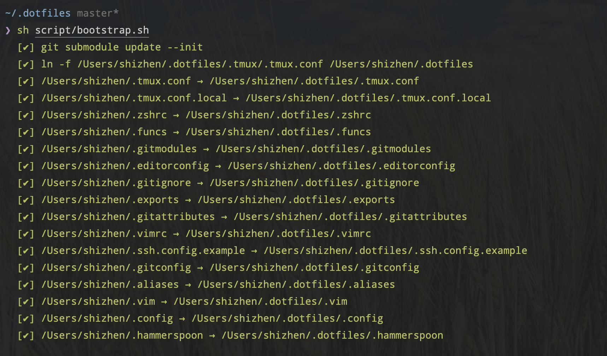
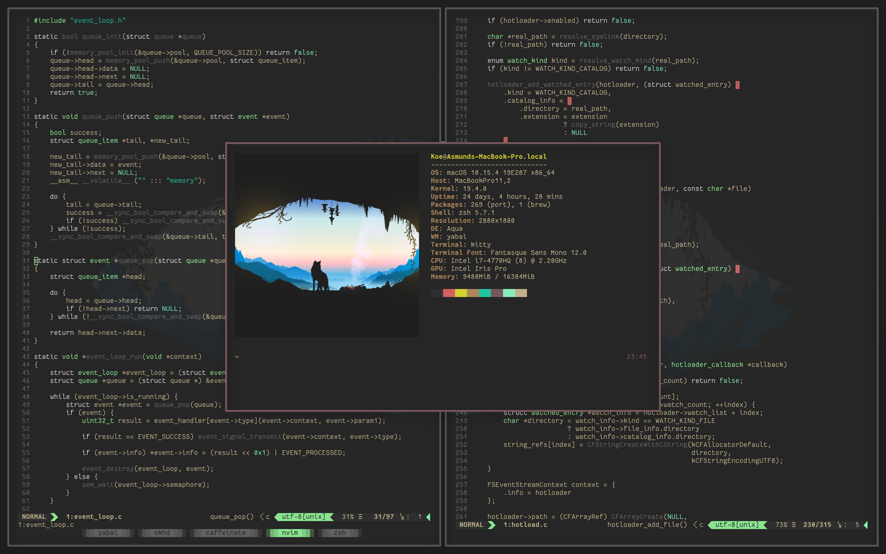
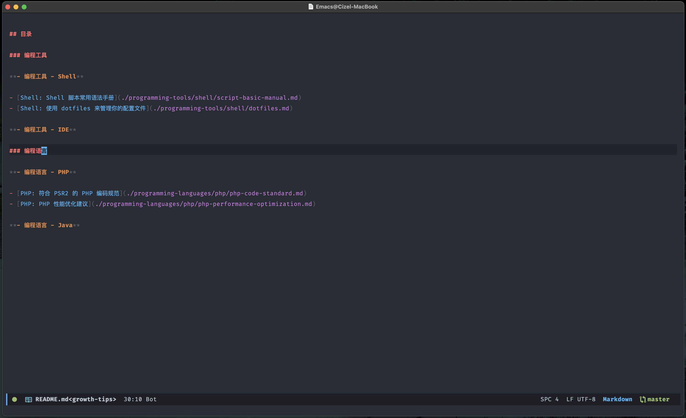

# 使用 Git 仓库来管理你的 dotfiles 配置实践

> 可以实践结构思考力的方式组织

使用 Git 仓库来管理你的 dotfiles 配置，这样的方式可以更加方便迁移以及复用。

你有没有遇到如下的：

1. 以前都是使用自己的笔记本工作，入职新公司要使用新的环境，怎么快速的搭建自己的 Shell 环境?
2. 大家提交的代码，总是会出现格式的冲突，如何让大家有使用同样一套配置？ 
3. 我有一些小的 Shell 的技巧想和大家分享，什么方式更好传承？

如果你使用 Git 仓库来管理你的 dotfiles 配置，这一些问题就可以很方便的解决。

## Dotfiles 配置管理让我们更高效 

### Dotfiles 是点开头的配置文件

在 Linux, MacOS 开发的时候，我们一般需要挺多基础环境的配置，例如：

- `.zshrc`
- `.bashrc`
- `.vim`
- `.gitconfig`
- `.gitignore_global`
- `tmux.conf`
- `.alacritty.yaml`
- `.i3/config`
- `...`

通俗来说，Dotfiles 就是 `.` 开头的配置文件

### Dotfiles 配置使用 Git 仓库管理更加高效 

> 你可以通过如下的方式，来整理你的配置, 参考：https://github.com/cizel/dotfiles (如果觉得不错，可以点一下 Star 呀)

具体的操作指南如下：

1. 在根目录下创建 .dotfiles 目录

```bash
#创建目录
mkdir ~/.dotfiles
#初始化仓库
cd ~/.dotfiles && git init
```

2. 添加软链接脚本(推荐)

```bash
# 当前目录 ~/.dotfiles
mkdir script && cd script
curl -O https://gitee.com/cizel/dotfiles/raw/master/script/bootstrap.sh
```

3. 移动相关的点文件到目录中

```bash
mv ~/.zshrc ~/.dotfiles/
mv ~/.tmux.conf ~/.dotfiles/
mv ~/.vim ~/.dotfiles/
mv ~/.gitconfig ~/.dotfiles/
mv ~/.gitignore ~/.dotfiles/
```

4. 执行脚本，生成软链接

```bash
cd ~/.dotfiles
sh script/bootstrap.sh
```



5. 使用 github 同步配置

```bash
git remote add origin git@github.com:{username}/dotfiles.git
git add .
git push -u origin master
```

6.在其他系统同步使用配置

```bash
git clone https://github.com/{username}/dotfiles ~/.dotfiles
cd ~/.dotfiles
script/bootstrap.sh
```

## 效果图

- Alacritty (终端模拟器)


- yabai 平铺桌面管理器




- ZSH 配置 (高亮，拼写提示, 历史提示)


- Tmux 配置


- Vim 配置


- Emacs 配置




## 相关链接 

- [cizel dotfiles 配置](https://github.com/cizel/dotfiles)
